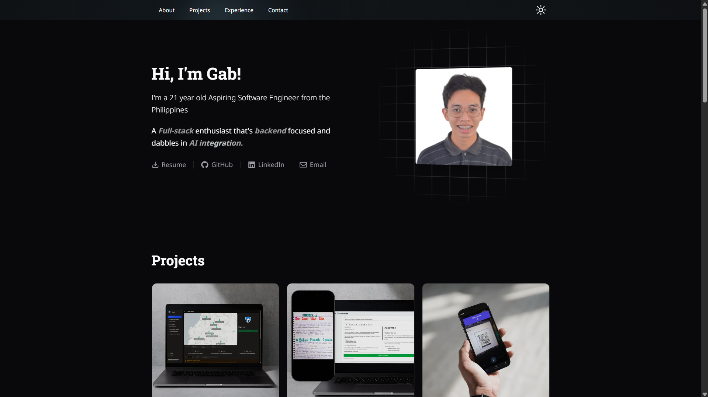
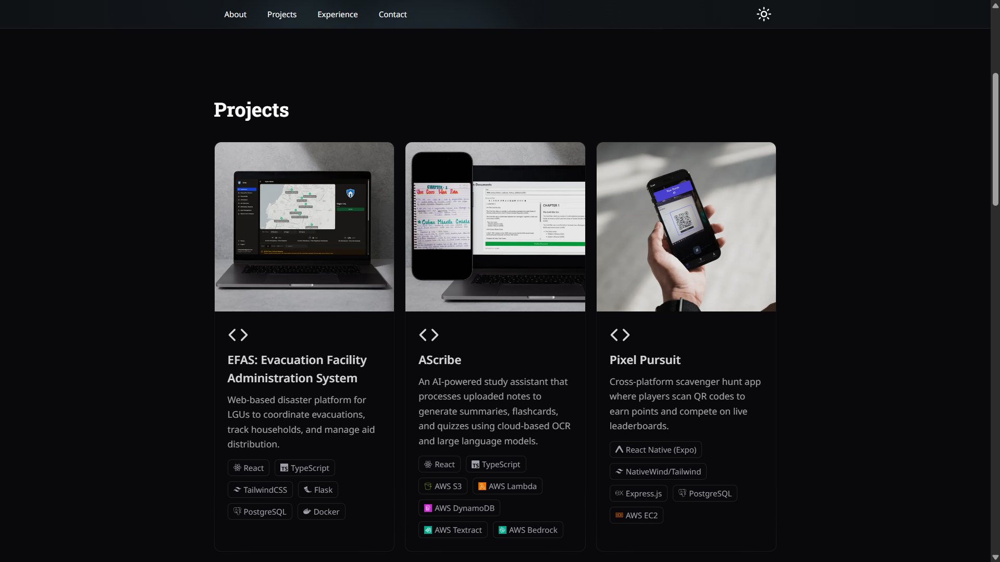
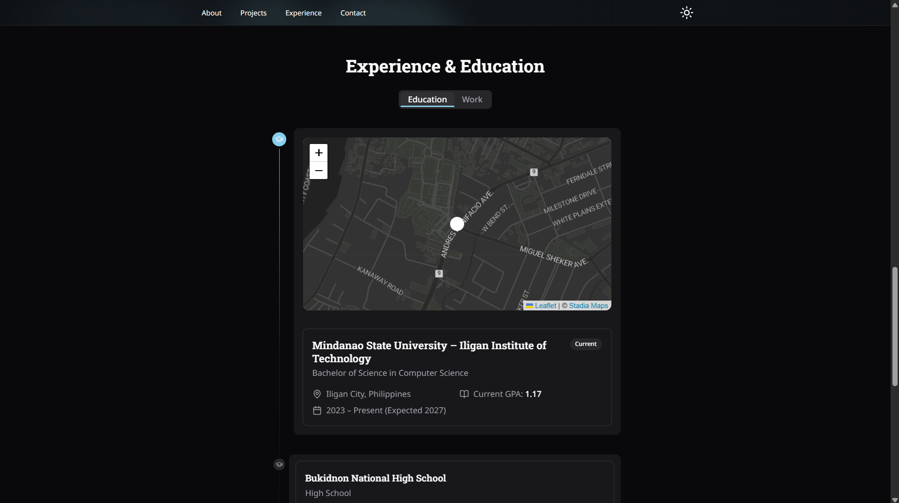
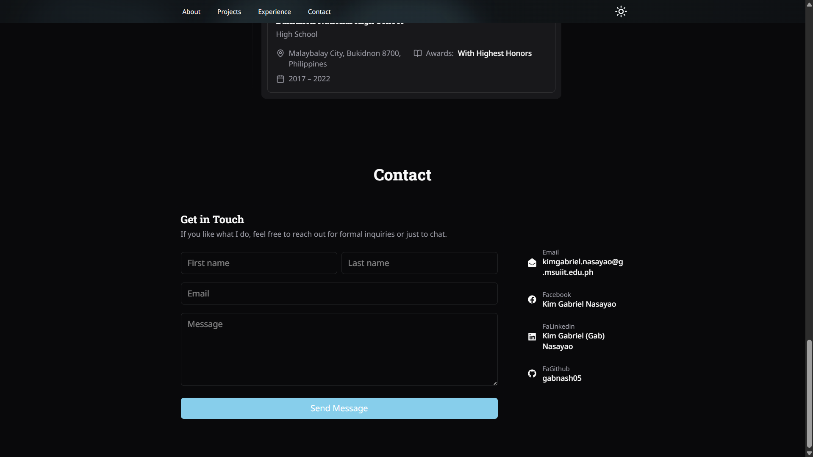

# Gab's Personal Portfolio

A personal portfolio website showcasing who I am, projects I've built, and my experience as an aspiring developer.

**Live Site:** [https://portfolio-tau-peach-ouuu42maas.vercel.app/](https://portfolio-tau-peach-ouuu42maas.vercel.app/)

---

## Features

- **About Me** — A quick intro to who I am and what I specialize in.
- **Projects Showcase** — Highlights of projects I've built.
- **Experience** — My educational background and experience as an aspiring developer.
- **Contact Form** — Reach out directly through the forms or through my socials.

---

## Technologies Used

| Category      | Tech                                                                       |
| ------------- | -------------------------------------------------------------------------- |
| Framework     | [Next.js](https://nextjs.org/)                                             |
| Styling       | [Tailwind CSS](https://tailwindcss.com/)                                   |
| UI Components | [shadcn/ui](https://ui.shadcn.com/)                                        |
| Email         | [Resend](https://resend.com/)                                              |
| Maps          | [Leaflet](https://leafletjs.com/) + [Stadia Maps](https://stadiamaps.com/) |
| Deployment    | [Vercel](https://vercel.com/)                                              |

---

## Getting Started

### Prerequisites

- Node.js 18+
- npm or yarn

### Installation

```bash
# Clone the repository
git clone https://github.com/gabnash05/portfolio.git
cd portfolio

# Install dependencies
npm install
```

### Environment Variables

Create a `.env.local` file in the root of your project:

```env
RESEND_API_KEY=your_resend_api_key
NEXT_PUBLIC_STADIA_API_KEY=your_stadia_maps_api_key
CONTACT_EMAIL=youremail@gmail.com
```

### Running Locally

```bash
npm run dev
```

Open [http://localhost:3000](http://localhost:3000) in your browser.

### Building for Production

```bash
npm run build
npm start
```

---

## Screenshots

**About Section**


**Projects Section**


**About Section**


**Contact Section**


---

## Contact

Feel free to reach out through the contact form on the [live site](https://portfolio-tau-peach-ouuu42maas.vercel.app/), or connect with me on:

- GitHub: [gabnash05](https://github.com/gabnash05)
- LinkedIn: [Kim Gabriel Nasayao](https://linkedin.com/in/kim-gabriel-nasayao)
